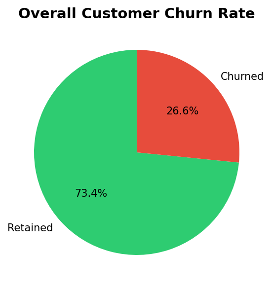
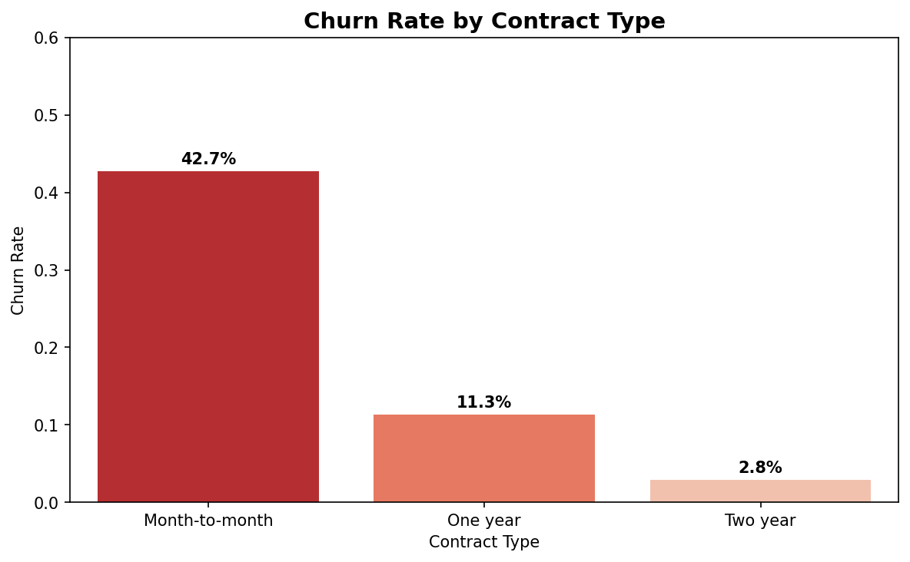
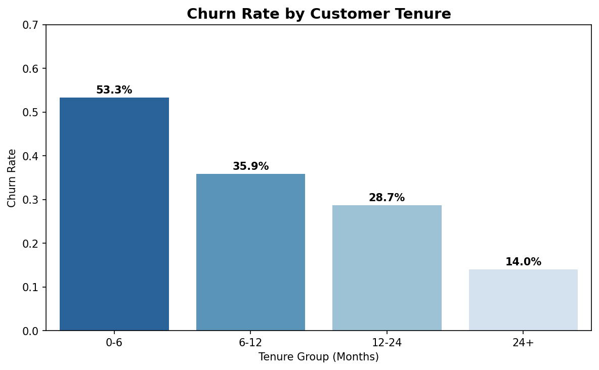
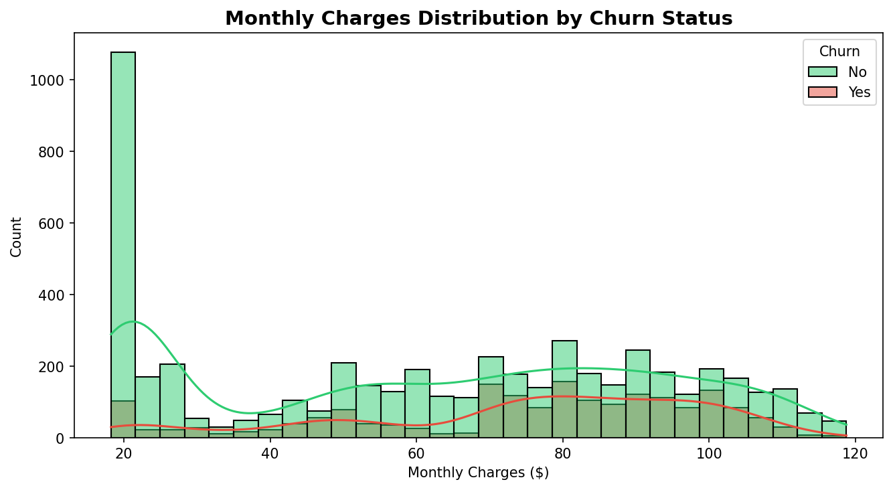
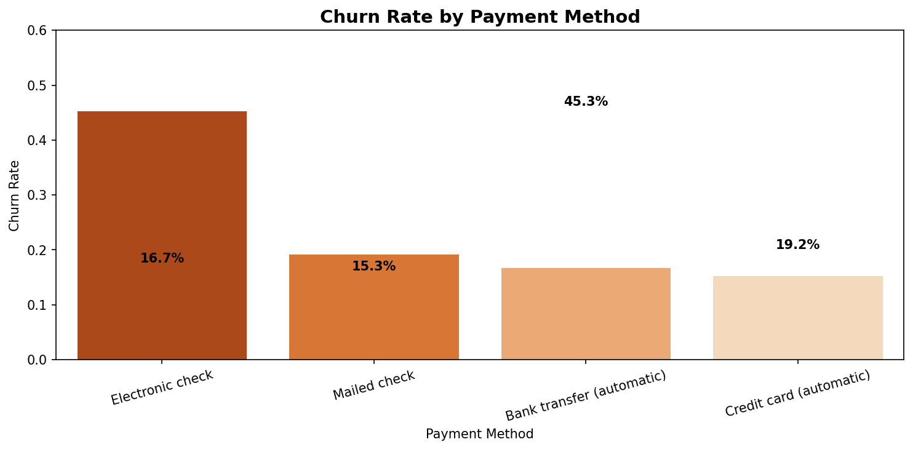

# Customer Churn Analysis
### Identifying Retention Risk and Business Insights

## View the Notebook
[Click here to view on NBViewer](https://github/asuhconcentric-droid/customer-churn-analysis/blob/main/Customer_Churn_Analysis.ipynb)

## Overview
This project analyzes customer churn behavior using the 
Telco Customer Churn dataset from Kaggle. The goal is to 
identify the key drivers of churn and provide actionable 
business recommendations to improve customer retention.

## Dataset
- Source: Kaggle -- Telco Customer Churn
- 7,043 customer records
- 21 features including contract type, internet service, 
payment method, tenure, and monthly charges

## Tools Used
- Python
- Pandas
- NumPy
- Matplotlib
- Seaborn
- Google Colab

## Key Findings
1. Overall churn rate is 26.6% -- roughly 1 in 4 customers leaves
2. Month-to-month contracts churn at 42.7% vs just 2.8% for two year contracts
3. New customers in their first 6 months churn at 53.3%
4. Electronic check users churn at 45.3% -- highest of any payment method
5. Fiber optic customers churn at 41.9% -- nearly double the DSL rate
6. Highest risk segment: Month-to-month + Fiber optic + Electronic check = 60.4% churn rate

## Visualizations

### Overall Churn Rate

### Churn Rate by Contract Type

### Churn Rate by Tenure Group

### Monthly Charges Distribution

### Churn Rate by Payment Method

## Business Recommendations
- Launch a contract upgrade incentive program targeting month-to-month customers
- Focus retention efforts on customers in their first 6 months
- Incentivize automatic payment methods to reduce electronic check usage
- Investigate fiber optic service quality and pricing competitiveness
- Build a customer health score to proactively flag high risk customers
